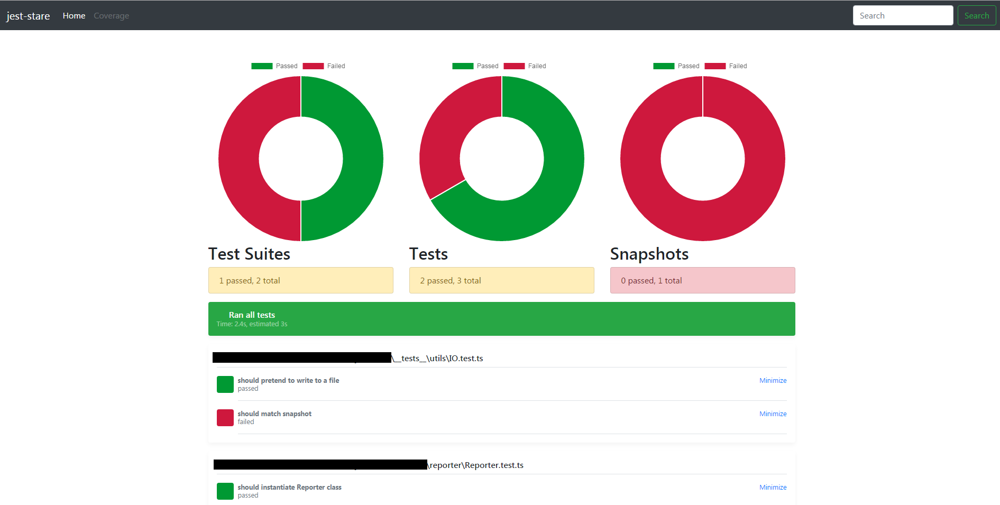

# Jest HTML Reporter (Results Processor)
Jest HTML reporter for people that hate plain-text.  Strictly speaking, this is a
"results processor" only.  That is, jest-stare takes the summary tests results and parses 
them into an HTML file for readability. 

This package also includes a reporter component (Reporter.ts); however, that piece is disabled
and all methods are stub routines (for future reference /usage).

## Usage
`jest --testResultsProcessor=jest-stare`

Or

`"testResultsProcessor": "./node_modules/jest-html-reporter",`

## WIP
This is a work in progress project and contributions are welcome.  

## Development Building / Testing

### First time setup
1. `git clone` this repo
2. `npm install`
5. `npm install typescript jest browserify -g`

### Try example
1. `tsc`
2. `npm run make`
3. `jest --reporters=./` OR `jest Reporter.test.ts --reporters=./`

### Screenshot

##  To Do
* fix lint
* link coverage if used
* snapshots updated, added, etc
* test
* travis
* coveralls
* publish