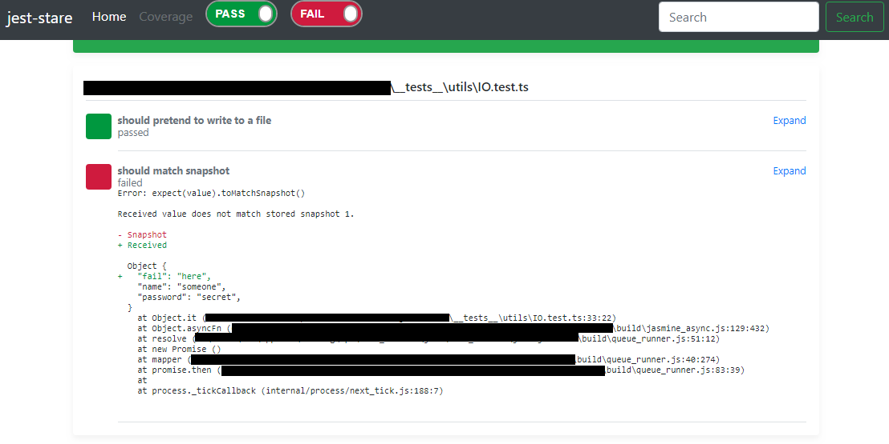

# Jest HTML Reporter (Results Processor) [](https://travis-ci.org/dkelosky/jest-stare)
Jest HTML reporter for people that hate plain-text.  Strictly speaking, this is a
"results processor" only.  That is, jest-stare takes the summary tests results and parses 
them into an HTML file for readability. 

This package also includes a reporter component (Reporter.ts); however, that piece is disabled
and all methods are stub routines (for future reference /usage).

## Usage
`jest --testResultsProcessor=jest-stare`

Or

`"testResultsProcessor": "./node_modules/jest-stare",`

## Config 
Thanks to [dogboydog](https://github.com/dogboydog) you can configure the default output location of the jest-stare html files in your package.json via:
```
jest-stare: {
    "resultDir": "results/jest-stare"
}
```

## Status
This is a work in progress project and contributions are welcome.  

### Screenshot
Simple examples below.

#### Sample Report


#### Sample Snapshot Diff


##  To Do
* link coverage if used or custom coverage reporter
* note snapshots updated, added, etc
* increase local tests 
* increase coverage
* minify / bundle distribution
* add overall test time

## Development Building / Testing
If you'd like to submit a PR, here are some basic steps to test out code changes.

### First time setup
1. `git clone` this repo
2. `npm install`
5. `npm install typescript jest browserify -g`

### Try example
1. `tsc`
2. `npm run build`
3. `jest --testResultsProcessor=./` OR `jest Reporter.test.ts --testResultsProcessor=./`
